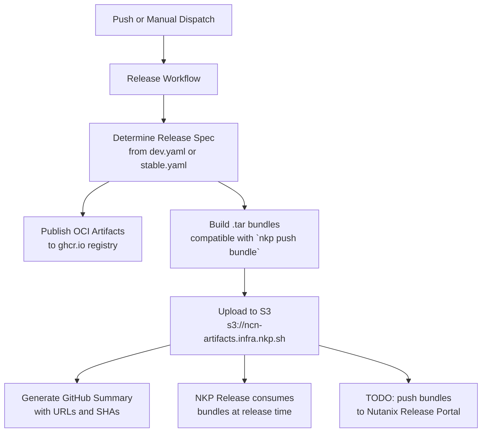

# Nutanix NKP Product Catalog

All source code and other contents in this repository are covered by the Nutanix License and Services Agreement, which is located at https://www.nutanix.com/legal/eula

# Overview

This catalog repository holds Nutanix products and their OCIRepository and HelmRelease manifests for the Nutanix Kubernetes Platform (NKP).

Full catalog documentation lives in the [NKP Catalog docs](https://nutanix-cloud-native.github.io/nkp-partner-catalog/docs).

# Documentation

## Concepts

- [OCI artifacts](https://nutanix-cloud-native.github.io/nkp-partner-catalog/docs/concepts/oci-artifact)
- [Flux](https://nutanix-cloud-native.github.io/nkp-partner-catalog/docs/concepts/flux)
- [Substitution variables](https://nutanix-cloud-native.github.io/nkp-partner-catalog/docs/concepts/substitution-variables)
- [Configuration overrides in Flux HelmRelease](https://nutanix-cloud-native.github.io/nkp-partner-catalog/docs/concepts/config-overrides-flux-hr)
- [Linter config (`.bloodhound.yml`)](https://nutanix-cloud-native.github.io/nkp-partner-catalog/docs/concepts/bloodhound-config)

## Workflows

- [Initialize a catalog application](https://nutanix-cloud-native.github.io/nkp-partner-catalog/docs/workflows/initialize-catalog-application)
- [Convert Helm charts to OCI](https://nutanix-cloud-native.github.io/nkp-partner-catalog/docs/workflows/convert-helm-to-oci)
- [Build catalog application](https://nutanix-cloud-native.github.io/nkp-partner-catalog/docs/workflows/build-oci-artifact)
- [Push artifacts](https://nutanix-cloud-native.github.io/nkp-partner-catalog/docs/workflows/push-oci-artifact)
- [Continuous Delivery](https://nutanix-cloud-native.github.io/nkp-partner-catalog/docs/workflows/release)
- [From OCI artifact to AppDeployment](https://nutanix-cloud-native.github.io/nkp-partner-catalog/docs/workflows/journey-oci-to-app-deployment)

### Release Workflow

The release process generates OCI artifacts and bundles for NKP catalog applications:



The workflow diagram shows the flow from trigger (push or manual dispatch) through spec determination, artifact publishing, bundle generation, and final consumption by NKP Release.


# Recipes

This project uses [Devbox](https://www.jetify.com/devbox) for `just`, `yq`, and
the other tools the recipes need. Enter a Devbox shell before running `just`.

```bash
# Install devbox (one-time)
curl -fsSL https://get.jetify.com/devbox | bash

# Enter the devbox shell (installs tools from devbox.json)
devbox shell
```

Without a shell, prefix recipes with `devbox run --` (for example
`devbox run -- just validate-manifests`). Running `just validate-manifests`
also regenerates `artifacts.yaml` (located at the repository root) automatically
when new applications are added. This validation runs automatically in
[CI](.github/workflows/manifest.yml) on every pull request.

New container images listed in `artifacts.yaml` must be accessible to the
`svcnkpcatalogci` service account used by CI. Create a DPRO ticket and ask the
Dev Prod team to grant the `svcnkpcatalogci` account read/push access to any
images added. Reach out to `#nkp-catalog` on Slack with any questions.

## Full bundle build

Full-bundle recipes use releases that set `includeApplicationImages: true` in
`.release/dev.yaml` or `.release/stable.yaml`, so the tarball includes container
images and OCI artifacts. See
[Continuous Delivery](https://nutanix-cloud-native.github.io/nkp-partner-catalog/docs/workflows/release)
and the [catalog release specification](https://nutanix-cloud-native.github.io/nkp-partner-catalog/docs/api/release).

```bash
# From a devbox shell:

# Single app → <app>-<version>-full.tar
just create-application-full-bundle ndk 2.1.0

# Collection tag from a release spec (default: .release/dev.yaml)
just create-collection-full-bundle 2.20.x-full
just create-collection-full-bundle 2.19.x-full "" .release/stable.yaml

# All image-inclusive tags in a spec
just build-full-bundles .release/stable.yaml ./bundles
```

## How to list all the catalog applications and collections on management cluster?

```
kubectl get ocirepository -A -l catalog.nkp.nutanix.com/catalog-source-artifact=true
```

## How to list all the apps provided by added catalogs on management cluster?

```
kubectl get apps -A
```

# Getting Help

- **Slack:** Join the `#nkp-catalog` channel on the Nutanix Slack workspace for questions and discussion.
- **DPRO tickets:** For infrastructure access requests (e.g., granting the `svcnkpcatalogci` service account access to new container images), submit a DPRO ticket to the Dev Prod team.
- **External documentation:** See the [NKP Catalog docs](https://nutanix-cloud-native.github.io/nkp-partner-catalog/docs) for comprehensive guides and reference material.
